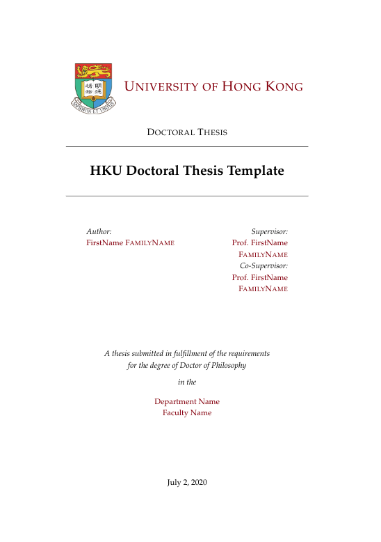
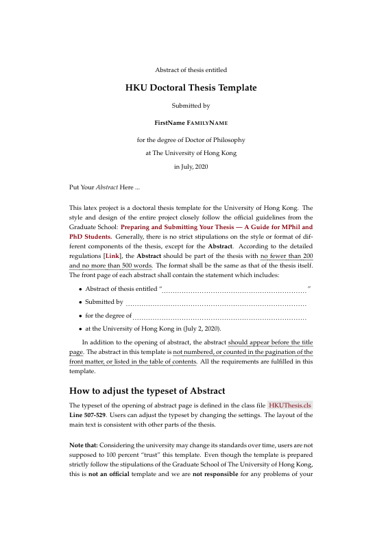
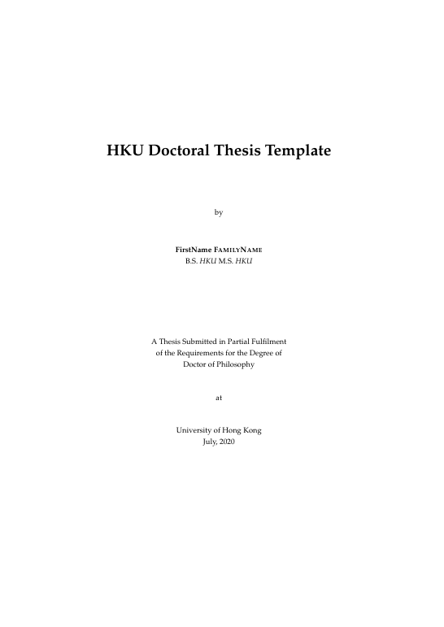
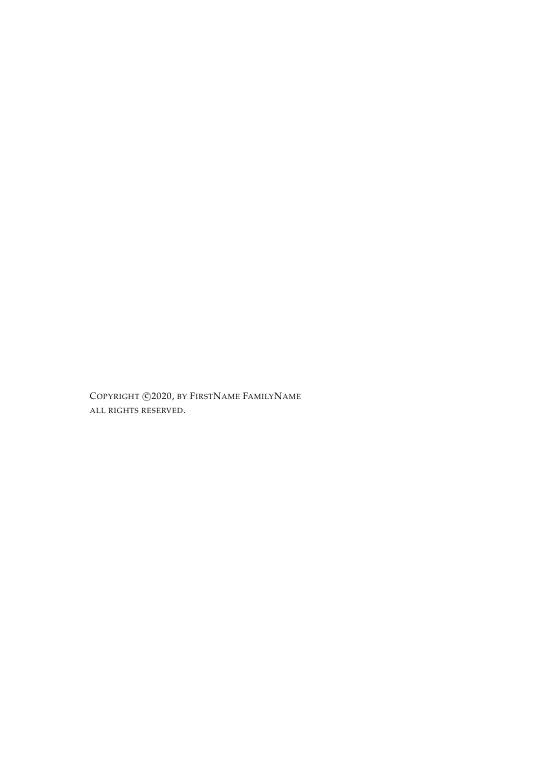
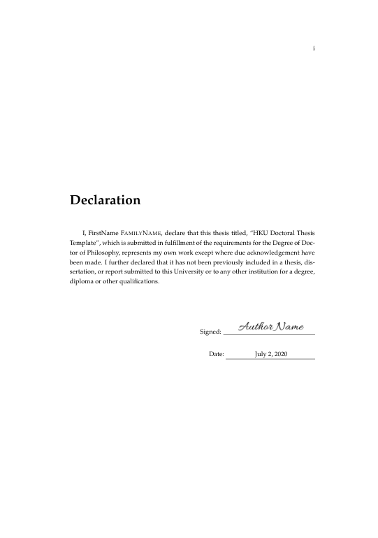
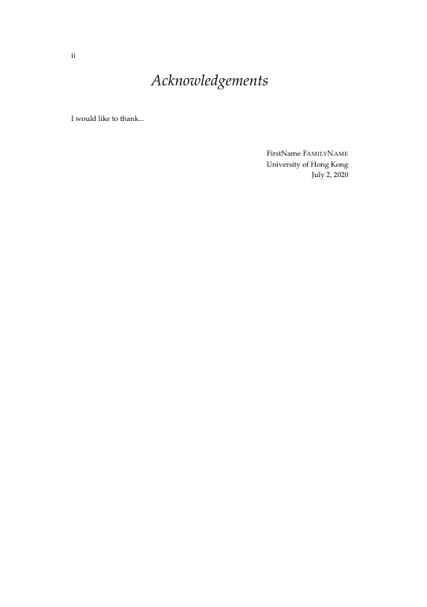
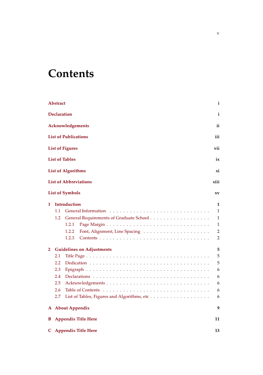
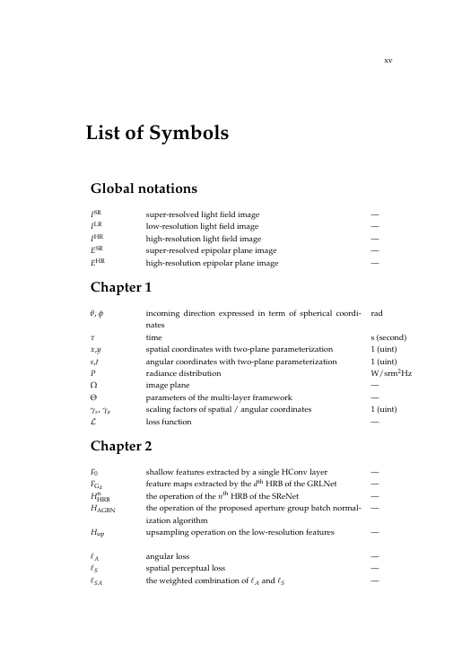

# Thesis Template for the University of Hong Kong

[](https://travis-ci.org/mbredel/thesis-template)

This LateX template is for **HKUers** to prepare their **Master/Doctoral Thesis**. The project is based on the template of [Sunil Patel](http://www.sunilpatel.co.uk/thesis-template/) and it is modified to meet the requirements of [Graduate School of The University of Hong Kong](https://www.gradsch.hku.hk/gradsch/current-students/thesis-submission). The current version is prepared according to the 13th edition booklet entitled [Preparing and Submitting Your Thesis --- A Guide for MPhil and PhD Students](https://intraweb.hku.hk/reserved_1/gradsch/PreparingandSubmittingYourThesis.pdf) (July 2019). Considering the university may change its stipulations over time, users are strongly suggested to read the latest booklet carefully and adjust the template accordingly to satisfy the stipulations of the university.




## License
```
Creative Commons Attribution-NonCommercial-NoDerivatives 4.0 International License
CC BY-NC-ND 4.0 (https://creativecommons.org/licenses/by-nc-nd/4.0/)
```
